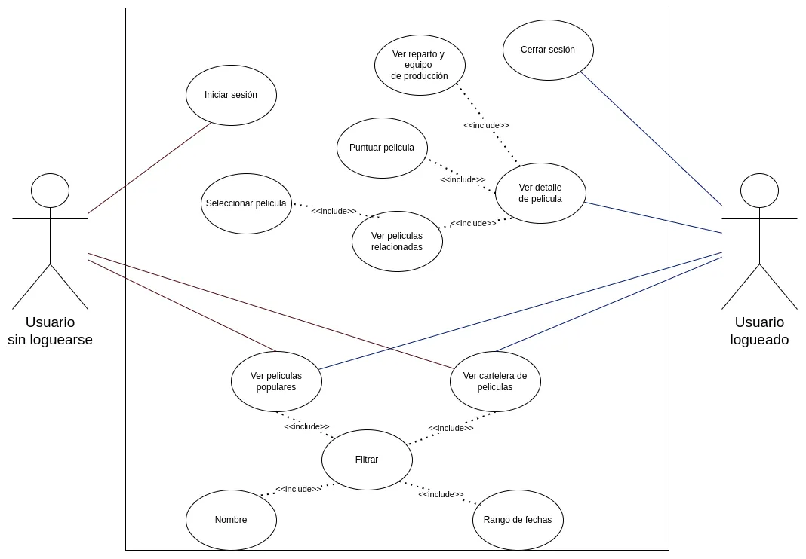

# Prueba Técnica Desarrollo Frontend - Harry Gómez

El objetivo de este proyecto es Crear una aplicación responsiva con Angular y TailwindCSS que permita a los
usuarios verificar una lista de películas en la red, verificar el listado de películas
más recientes y tener acceso a información detallada sobre cada película. La
aplicación debe cumplir con los siguientes requisitos:


## Requisitos

- Desarrollo de aplicaciones web con Angular
- Consumo de API´s RESTful
- Diseño y desarrollo de interfaces de usuario
- Buenas practicas de programación

## Credenciales de usuario prueba  
Usuario utilizado para la validacion de rutas y validación de inputs en el login.  
```
correo: usuario@ejemplo.com
contraseña: 123456
```

# Documentación del proyecto

## Diseño de Interfaces  
**Mockups** del proyecto en Figma aquí:  
[Ver Mockups en Figma](https://www.figma.com/design/8QA6qE49iSGBvIvyXssSSI/PruebaTecnica-Pagalo?node-id=0-1&t=e7DMhNK8cvroyHb0-1)


## Documentacion técnica  
Acá se encuentra código relevante que debe ser explicado:  
* [Consumo API](./docs/apiMovies.md)  
* [Guardianes](./docs/guard.md)  
* [Interceptores](./docs/interceptor.md)  


## Creación del Proyecto  
Para generar un nuevo proyecto en **Angular 14**, ejecuta el siguiente comando:  

```sh
npx -p @angular/cli@14 ng new pruebaTecnica --skip-tests
```

## Instalación del Proyecto  
Una vez clonado o generado el proyecto, instala las dependencias necesarias:  

```sh
npx npm install
```
Luego, instala los tipos de Node.js requeridos para el desarrollo:  
```sh
npx npm install @types/node@16 --save-dev
```


## Ejecución del Servidor de Desarrollo  
Para iniciar el servidor local y ver el proyecto en el navegador, usa:  

```sh
npx ng serve
```

## Ejecución del Servidor de Desarrollo  
Para iniciar el servidor local y ver el proyecto en el navegador, usa:  

```sh
npx ng serve
```

## Funciones del usuario


## Frameworks o librerias utilizadas
- Angular 14: Framework principal para el desarrollo del frontend.
- Tailwind CSS: Para el diseño y estilización del proyecto.
- RxJS: Para manejo de programación reactiva en Angular.
